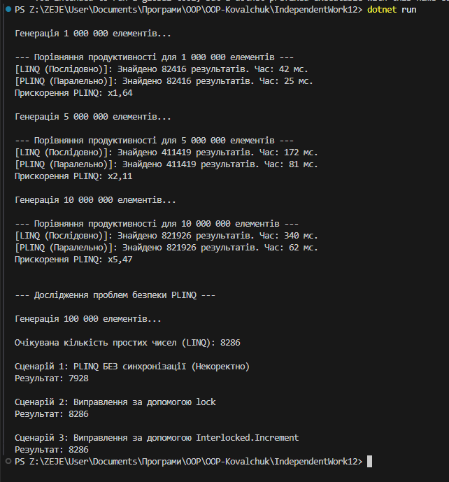

# Звіт до Самостійної роботи №12
## Тема: PLINQ: дослідження продуктивності та безпеки

**Мета:** Дослідити переваги та недоліки PLINQ (Parallel LINQ) у порівнянні зі звичайним LINQ, виміряти його продуктивність на різних обсягах даних та проаналізувати потенційні проблеми безпеки при паралельній обробці.

**Обчислювальна операція:** Перевірка на просте число (`IsPrime`).

**Приклад запуску (скриншот виводу)**

---

## 1. Експерименти з продуктивності (LINQ vs PLINQ)

Експерименти проводились із використанням операції `IsPrime` на різних обсягах даних для порівняння послідовного (LINQ) та паралельного (PLINQ) виконання. Час вимірювався за допомогою `System.Diagnostics.Stopwatch`.

### Таблиця результатів

| Розмір колекції | LINQ (Послідовно) | PLINQ (Паралельно) | Прискорення (разів) |
| :-------------: | :---------------: | :----------------: | :-------------------: |
| 1 000 000       | **42 мс** | **25 мс** | **x1,64** |
| 5 000 000       | **172 мс** | **81 мс** | **x2,11** |
| 10 000 000      | **340 мс** | **62 мс** | **x5,47** |

### Аналіз продуктивності

1.  **Коли PLINQ швидший?**
    PLINQ продемонстрував значне прискорення (до **x5,47**) зі зростанням обсягу даних. Це підтверджує, що для **CPU-bound** (обмежених обчислювальною потужністю) задач, де робота над елементами є незалежною, паралельне виконання є високоефективним. Прискорення збільшується зі зростанням обсягу, оскільки накладні витрати на управління потоками компенсуються виграшем від паралельної обробки.
2.  **Коли PLINQ недостатньо швидкий?**
    На менших обсягах (1 млн) прискорення мінімальне (x1,64). Це пов'язано з тим, що накладні витрати (overhead) на розбиття колекції, ініціалізацію та синхронізацію потоків споживають значну частину виграшу.

---

## 2. Дослідження проблем безпеки (Побічні ефекти)

Був протестований сценарій, де PLINQ модифікував спільну змінну `sharedCounter`. Очікуваний коректний результат становив **8286**.

### Результати сценаріїв

| Сценарій | Механізм синхронізації | Очікуваний результат | Отриманий результат | Статус |
| :------: | :--------------------: | :------------------: | :-----------------: | :----: |
| **PLINQ 1**| **Немає** | 8286                 | **7928** | **НЕКОРЕКТНО**|
| PLINQ 2  | `lock`                 | 8286                 | 8286                | Коректно|
| PLINQ 3  | `Interlocked.Increment`| 8286                 | 8286                | Коректно|

### Аналіз побічних ефектів

1.  **Проблема (Сценарій 1):** Отриманий результат (7928) був меншим за очікуваний (8286). Це виникло через **умову гонки (Race Condition)**. Операція збільшення (`sharedCounter++`) не є атомарною; кілька паралельних потоків одночасно намагалися модифікувати змінну, що призвело до **втрати операцій збільшення**.
2.  **Виправлення:**
    * Використання **`lock` (Сценарій 2)**: Гарантувало ексклюзивний доступ до критичної секції (збільшення лічильника), забезпечивши потокобезпечність та коректний результат.
    * Використання **`Interlocked.Increment` (Сценарій 3)**: Надало швидшу та ефективнішу **атомарну** операцію для потокобезпечного збільшення цілого числа, також гарантуючи коректний результат.

---

## 3. Загальні Висновки

1.  **Доцільність PLINQ:** PLINQ є потужним інструментом для підвищення продуктивності в **обчислювально інтенсивних** задачах на великих наборах даних. Його слід використовувати лише тоді, коли виграш від паралелізму виправдовує накладні витрати.
2.  **Безпека та особливості:** При використанні PLINQ необхідно суворо контролювати **побічні ефекти**. Будь-яка модифікація спільного стану зсередини паралельного запиту повинна бути захищена механізмами синхронізації (`lock`) або атомарними операціями (`Interlocked`), щоб гарантувати коректність результатів та уникнути умов гонки.