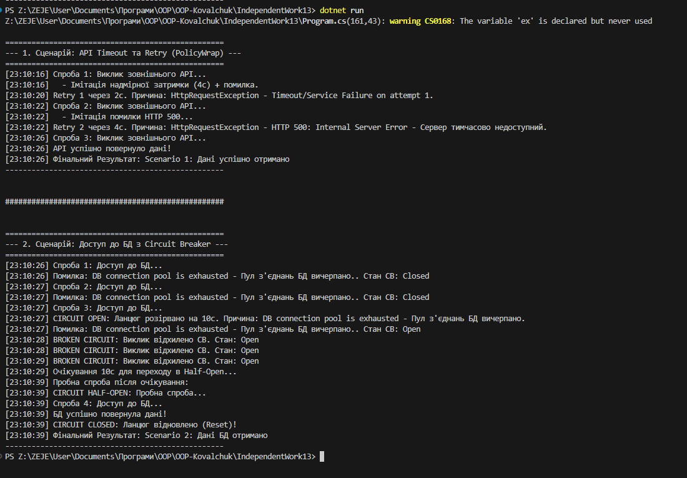

# Звіт до Самостійної роботи №13: Кейси Polly/Retry

**Тема:** Polly/Retry: дослідження та аналіз реальних сценаріїв використання бібліотеки Polly.
**Мета:** Дослідити та проаналізувати політики відмовостійкості (**Retry**, **Circuit Breaker**, **Timeout**) у .NET-застосунках.

---

## 1. Сценарій: Виклик зовнішнього API з комбінованим захистом (Retry + Timeout)

### Опис проблеми
Зовнішні сервіси (API) страждають від **транзиентних (тимчасових) помилок** (HTTP 5xx) та/або **надмірного часу очікування** (Timeout), що може заблокувати потік застосунку.

### Вибір та обґрунтування політики Polly
* **Політика:** **PolicyWrap** (**Timeout** всередині **Retry**).
* **Обґрунтування:**
    * **Retry (WaitAndRetry):** Обробляє тимчасові помилки та помилки таймауту. Використання **експоненційної затримки** (`TimeSpan.FromSeconds(Math.Pow(2, retryAttempt))`) є критичним для запобігання перевантаженню зовнішнього сервісу.
    * **Timeout:** Забезпечує, що операція не триватиме довше встановленого ліміту (2с), захищаючи системні ресурси.

### Фрагмент коду (Імітація)
* *Див. метод `Scenario1_ApiTimeoutAndRetry` у `Program.cs`.*

### Очікувана поведінка та вивід логів
Програма виконує 3 спроби:
1.  **Спроба 1:** Імітує затримку та помилку. Лог: ` Retry 1 через 2с. Причина: HttpRequestException...`.
2.  **Спроба 2:** Імітує HTTP 500. Лог: ` Retry 2 через 4с. Причина: HttpRequestException...`.
3.  **Спроба 3:** Успіх. Лог: ` API успішно повернуло дані!`
4.  **Результат:** Операція успішно завершується на 3-й спробі.

---

## 2. Сценарій: Доступ до БД з тривалою, стійкою відмовою

### Опис проблеми
У разі **стійкої відмови** (наприклад, вичерпання пулу з'єднань БД), постійні запити створюють **каскадний збій**. Необхідно **ізолювати** збійний компонент.

### Вибір та обґрунтування політики Polly
* **Політика:** **Circuit Breaker (Запобіжник)**. 
* **Обґрунтування:** **Circuit Breaker** переводить систему у стан **`Open` (розірвано)** після 3 послідовних помилок. У цьому стані він миттєво відхиляє нові запити протягом 10 секунд, **запобігаючи марній витраті ресурсів клієнта**.

### Фрагмент коду (Імітація)
* *Див. метод `Scenario2_DatabaseCircuitBreaker` у `Program.cs`.*

### Очікувана поведінка та вивід логів
1.  **Помилки 1-3:** `InvalidOperationException`. Після 3-ї помилки лог: ` CIRCUIT OPEN: Ланцюг розірвано на 10с...`.
2.  **Наступні спроби (Спроби 4-6):** **Polly** миттєво викидає `BrokenCircuitException`. Лог: ` BROKEN CIRCUIT: Виклик відхилено CB. Стан: Open`.
3.  **Після 10 секунд:** Ланцюг переходить у стан **`Half-Open`**.
4.  **Пробна спроба (Спроба 7):** Успіх. Лог: ` CIRCUIT CLOSED: Ланцюг відновлено (Reset)!`.

---

## 3. Сценарій: Захист від занадто повільної операції

### Опис проблеми
Будь-яка операція може **зависнути** або виконатися занадто повільно, блокуючи потік застосунку та споживаючи ресурси. Це може призвести до **виснаження пулу потоків**.

### Вибір та обґрунтування політики Polly
* **Політика:** **Timeout (Таймаут)**.
* **Обґрунтування:** **Timeout Policy** дозволяє встановити жорсткий часовий ліміт на виконання операції. Якщо операція не завершується вчасно, вона примусово переривається (викидаючи `TimeoutRejectedException`), захищаючи систему від **блокування**.

### Фрагмент коду (Імітація)
* *Ця логіка реалізована як частина PolicyWrap у Сценарії 1, але може бути використана окремо.*

### Очікувана поведінка та вивід логів
1.  **Спроба 1 (Виконання < таймауту):** Операція успішна.
2.  **Спроба 2 (Виконання > таймауту):** Операція перевищує ліміт. Лог: `⏱️ Таймаут: Операція перевищила 2.0с. Час вичерпано!`. У блоці `catch` реєструється `TimeoutRejectedException`.

---

## Загальні висновки

Використання бібліотеки Polly є **фундаментальним** для створення **відмовостійких (resilient)** .NET-застосунків. Вона дозволяє:

1.  **Автоматично обробляти транзиентні помилки (Retry):** Зменшує кількість збоїв, спричинених тимчасовими проблемами.
2.  **Запобігати каскадним збоям (Circuit Breaker):** Ізолює стійкі збої в одній частині системи, захищаючи інші компоненти від перевантаження.
3.  **Контролювати час виконання (Timeout):** Захищає ресурси застосунку від блокування повільними або завислими операціями.

Polly надає декларативний та чистий підхід до реалізації цих критичних політик, значно підвищуючи надійність мікросервісів та розподілених систем.

