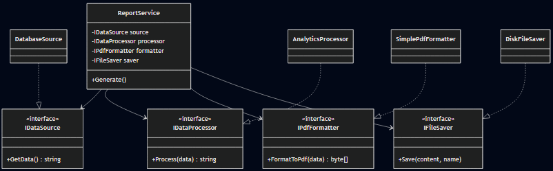

# Самостійна робота №16
## Тема: Схема розподілу відповідальностей модуля

## 1. Початковий клас ReportGenerator (Порушення SRP)
Клас `ReportGenerator` виконував занадто багато функцій: отримання даних, їх обробку, форматування у PDF та фізичне збереження на диск. Це створювало високу зв'язаність (tight coupling) — зміна формату файлу або джерела даних вимагала б зміни всього класу.

## 2. Рефакторинг та декомпозиція
Для дотримання принципу **SRP** функціональність була розподілена між чотирма спеціалізованими інтерфейсами:
- **IDataSource**: Відповідає лише за отримання сирих даних.
- **IDataProcessor**: Виконує аналіз та трансформацію даних.
- **IPdfFormatter**: Займається виключно візуальним представленням (PDF).
- **IFileSaver**: Забезпечує запис байтів на фізичний носій.

## 3. Використання DIP та DI
Клас `ReportService` тепер не знає про конкретні реалізації (наприклад, що дані йдуть з бази SQL). Він залежить від абстракцій (інтерфейсів), які передаються йому через конструктор. Це дозволяє легко замінити збереження на диск відправкою у хмару без зміни логіки генерації звіту.

## Висновок
- **SRP** дозволив створити малі, легкі для тестування класи.
- **UML-діаграма** допомогла візуалізувати зв'язки та переконатися у відсутності циклічних залежностей.
- Декомпозиція модуля зробила систему масштабованою та гнучкою до змін вимог.
## Схема
