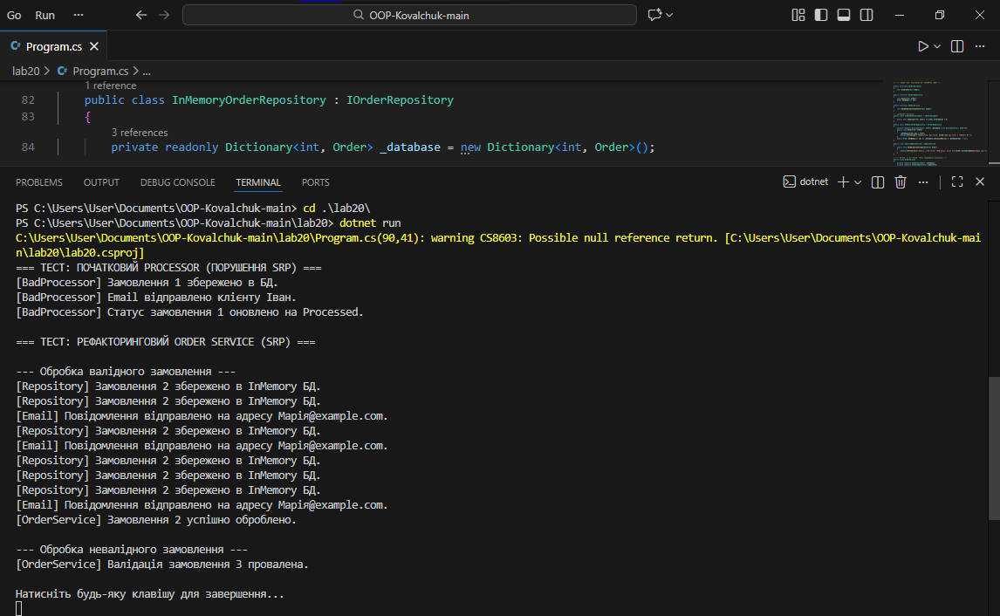

# Лабораторна робота №20
## Тема: SRP: декомпозиція OrderProcessor.

## 1. Опис початкової проблеми
Клас `BadOrderProcessor` порушував принцип **Single Responsibility Principle (SRP)**, оскільки поєднував у собі чотири різні зони відповідальності:
1. Бізнес-логіку валідації.
2. Роботу з даними (збереження в БД).
3. Комунікацію з клієнтом (відправка пошти).
4. Керування життєвим циклом замовлення.

Будь-яка зміна у системі відправки пошти або структурі БД вимагала б зміни коду процесора, що робило систему крихкою.

## 2. Опис рефакторингу
В рамках лабораторної роботи функціональність була розділена на окремі компоненти:
- **IOrderValidator**: Відповідає виключно за перевірку коректності даних замовлення.
- **IOrderRepository**: Відповідає за абстракцію над збереженням даних.
- **IEmailService**: Відповідає за інформування клієнта.
- **OrderService**: Клас-оркестратор, який координує процес через **Dependency Injection (DI)**.

## 3. Висновки
Застосування SRP дозволило:
- Спростити тестування окремих компонентів.
- Забезпечити легку заміну реалізацій (наприклад, перехід на іншу БД без зміни `OrderService`).
- Зробити код більш читабельним та відповідним стандартам Clean Code.
## Приклад запуску
