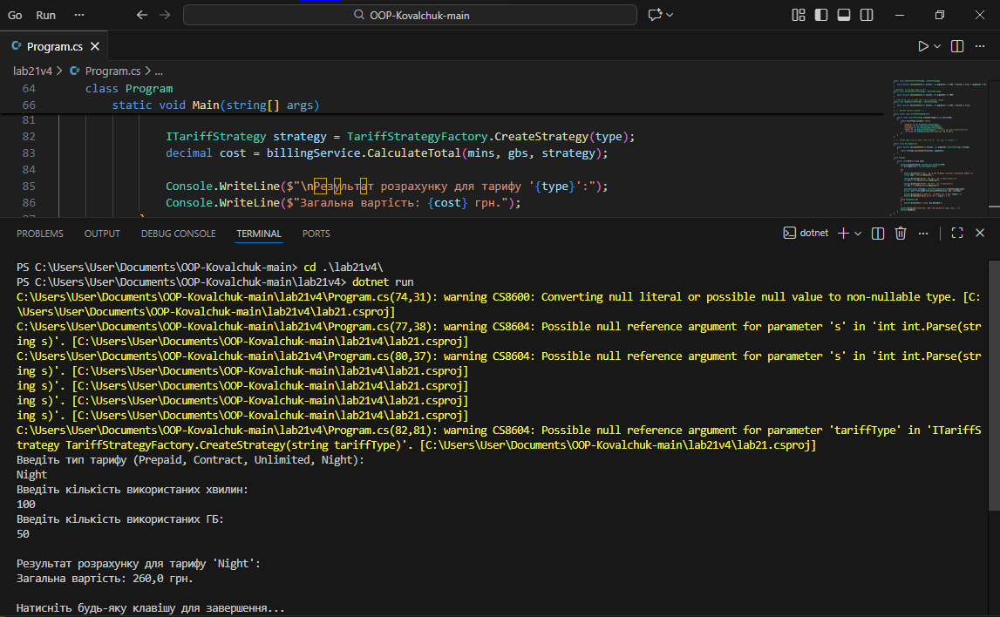

# Лабораторна робота №21
## Тема: OCP: гнучкі алгоритми розрахунку (Factory/Strategy).
## Мета: Застосувати принцип відкритості/закритості (OCP) для створення гнучкої системи розрахунків за допомогою патернів Factory Method та Strategy.

## 1. Початкова архітектура (дотримання OCP)

### Опис ієрархії
Було реалізовано систему розрахунку вартості мобільного зв'язку (Варіант №4). Система базується на інтерфейсі `ITariffStrategy`, який визначає метод розрахунку ціни залежно від хвилин та гігабайтів.

Було створено три основні стратегії:
- `PrepaidTariffStrategy` (Передплата)
- `ContractTariffStrategy` (Контракт)
- `UnlimitedTariffStrategy` (Безліміт)

## 2. Реалізація патернів Factory та Strategy
Для керування створенням стратегій було впроваджено клас `TariffStrategyFactory`. Це дозволяє клієнтському коду отримувати потрібний алгоритм розрахунку за допомогою рядкового ідентифікатора, не знаючи про деталі реалізації конкретних класів.

Клас `BillingService` виконує роль контексту. Він закритий для модифікації, оскільки працює виключно з інтерфейсом `ITariffStrategy`.

## 3. Демонстрація принципу OCP
Головною перевагою такої архітектури є легкість розширення. Для демонстрації принципу **Open/Closed Principle** було виконано наступне:
1. Створено новий клас `NightTariffStrategy` з власною логікою розрахунку.
2. Додано підтримку нового тарифу у фабрику.
3. Логіка класу `BillingService` при цьому залишилася абсолютно незмінною.

## 4. Структура класів
- `ITariffStrategy` — базовий інтерфейс алгоритмів.
- `TariffStrategyFactory` — фабрика для створення об'єктів.
- `BillingService` — сервіс, що використовує стратегії для обчислень.

## 5. Коректна робота програми
Програма успішно обробляє ввід користувача. Користувач може вказати будь-який тип тарифу, а система автоматично підбере правильний алгоритм розрахунку. Це виключає використання громіздких конструкцій `if-else` у бізнес-логіці.

## Висновок
- Використання патерну **Strategy** дозволяє ізолювати алгоритми розрахунку.
- Патерн **Factory Method** централізує логіку створення об'єктів.
- Дотримання **OCP** гарантує, що система може нарощувати функціонал (нові тарифи) без ризику зламати вже протестований існуючий код.
