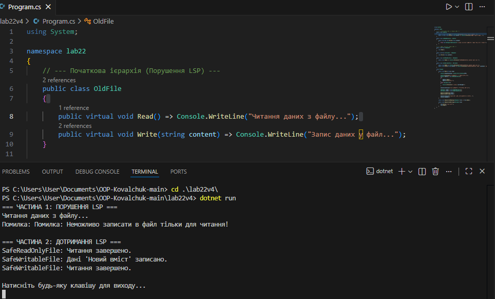

# Лабораторна робота №22
## Тема: LSP: виявлення порушень і альтернативи.
## Мета: Поглибити розуміння принципу підстановки Лісков (LSP), навчитися ідентифікувати його порушення в ієрархіях класів та застосовувати альтернативні підходи (композиція, зміна ієрархії) для створення LSP-сумісних рішень.

## 1. Початкова ієрархія класів (з порушенням LSP)

### Опис ієрархії
Було реалізовано базовий клас `BaseFile`, який представляє файл з можливістю читання та запису і має методи `Read()` та `Write(content)` для роботи з даними.

Від нього наслідується клас `ReadOnlyFile`, який перевизначає метод `Write` та забороняє запис даних, викидаючи виняток.

## 2. Аналіз порушення принципу LSP
Принцип підстановки Лісков стверджує, що об’єкти похідного класу повинні коректно замінювати об’єкти базового класу без зміни очікуваної поведінки програми.

У даному випадку:
- Базовий клас `BaseFile` гарантує, що метод `Write` успішно записує дані у файл.
- Похідний клас `ReadOnlyFile` порушує цей контракт, оскільки забороняє запис та викидає виняток.
- Клієнтський код працює з типом `BaseFile` і очікує, що метод `Write` завжди працює коректно.

Таким чином, підстановка `ReadOnlyFile` замість `BaseFile` призводить до некоректної роботи програми, що є прямим порушенням LSP.

## 3. Альтернативне рішення з дотриманням LSP
**Обраний підхід**

Було обрано підхід зміни ієрархії класів шляхом використання інтерфейсів. Функціональність читання та запису файлів була розділена.

## 4. Нова структура класів
**Опис:**

`IReadable` — інтерфейс для файлів тільки для читання.

`IWritable` — інтерфейс для файлів з підтримкою запису (успадковує `IReadable`).

`SafeWritableFile` реалізує `IWritable`.

`SafeReadOnlyFile` реалізує лише `IReadable` і не має методу `Write`.

## 5. Коректна робота клієнтського коду
Клієнтський код тепер чітко працює лише з тими об’єктами, які підтримують зміну стану (запис). `SafeReadOnlyFile` не може бути переданий у методи, що потребують `IWritable`, що виключає помилки під час виконання ще на етапі компіляції.

## Висновок
- Порушення принципу LSP може призводити до неочікуваних помилок у програмі.
- Наслідування не повинно змінювати поведінковий контракт базового класу.
- Розділення інтерфейсів дозволяє чітко визначити можливості об’єктів.
- Дотримання LSP підвищує надійність, читабельність та масштабованість коду.
## Приклад запуску
