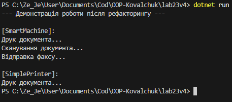

# Лабораторна робота No23
## Тема: ISP & DIP: рефакторинг і DI через конструктор.
## Мета: Застосувати принципи розділення інтерфейсу (ISP) та інверсії залежностей (DIP) для рефакторингу існуючого коду, а також реалізувати Dependency Injection (DI) через конструктор для зменшення зв’язаності та покращення тестування.

## 1. Початкова ієрархія класів (з порушенням ISP та DIP)

### Опис ієрархії
Було реалізовано загальний інтерфейс `IMachine`, який вимагає реалізації трьох методів: `Print()`, `Scan()` та `Fax()`.

Клас `SmartMachine` реалізує цей інтерфейс, але порушує принцип DIP, оскільки жорстко створює екземпляри конкретних класів `PrinterModule`, `ScannerModule` та `FaxModule` безпосередньо у своєму конструкторі. 
Клас `SimplePrinter` також змушений реалізовувати `IMachine`, хоча йому потрібен лише друк, що призводить до реалізації методів-заглушок, які викидають винятки.

## 2. Аналіз порушення принципів ISP та DIP
Принцип розділення інтерфейсу (ISP) вимагає, щоб класи не залежали від методів, які вони не використовують. Принцип інверсії залежностей (DIP) вказує на те, що класи вищого рівня не повинні залежати від класів нижчого рівня.

У даному випадку:
- Загальний інтерфейс `IMachine` порушує ISP. Якщо користувачу чи класу (наприклад, `SimplePrinter`) потрібен лише друк, він змушений тягнути за собою непотрібні методи сканера і факсу.
- Клас `SmartMachine` порушує DIP, оскільки самостійно створює залежності (`PrinterModule` тощо) через ключове слово `new`. Це створює жорсткий зв'язок, унеможливлює підміну модулів (наприклад, для тестування) та порушує гнучкість системи. 

## 3. Альтернативне рішення з дотриманням ISP та DIP
**Обраний підхід**

Було вирішено розділити "товстий" інтерфейс на три вузькоспеціалізовані: `IPrinter`, `IScanner` та `IFax`. Також було застосовано патерн Dependency Injection (DI) через конструктор, щоб класи вищого рівня отримували свої залежності ззовні у вигляді абстракцій.

## 4. Нова структура класів
**Опис:**

`IPrinter`, `IScanner`, `IFax` — спеціалізовані інтерфейси для кожної окремої функції.

`PrinterModule`, `ScannerModule`, `FaxModule` — класи, що реалізують відповідні вузькоспеціалізовані інтерфейси.

`SmartMachine` реалізує всі три інтерфейси, але тепер отримує необхідні модулі через конструктор.

`SimplePrinter` реалізує лише інтерфейс `IPrinter`, позбавляючись методів-заглушок для сканування та факсу.

## 5. Коректна робота клієнтського коду
Клієнтський код тепер бере на себе відповідальність за створення модулів та їх передачу в пристрої (інжекція залежностей). Кожен пристрій виконує лише ті функції, які підтримує. `SimplePrinter` більше не має доступу до методів сканування чи факсу, що виключає генерацію помилок.

## Висновок
- Розділення великого інтерфейсу на спеціалізовані (ISP) дозволило уникнути "сміттєвого" коду та винятків типу `NotImplementedException` у класах, яким не потрібен весь функціонал.
- Заміна жорсткого створення об'єктів на впровадження залежностей через конструктор (DIP та DI) зробила класи `SmartMachine` та `SimplePrinter` незалежними від конкретних реалізацій модулів. 
- Тепер модулі можна легко замінювати, оновлювати або підміняти тестовими (mock) об'єктами без зміни коду самих пристроїв.
- Дотримання цих принципів суттєво знизило зв'язність системи, покращило її читабельність та підготувало архітектуру до легкого масштабування.
## Приклад запуску
