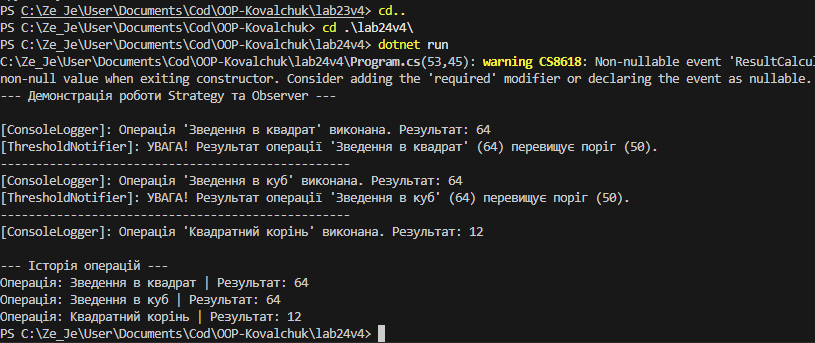

# Лабораторна робота No24
## Тема: Strategy + Observer: динамічна підстановка алгоритмів + тести.
## Мета: Застосувати патерни Strategy та Observer для створення гнучкої системи, яка дозволяє динамічно змінювати алгоритми обробки даних та автоматично сповіщати залежні компоненти про зміни, а також написати юніт-тести для перевірки цієї функціональності.

## 1. Аналіз та структура системи

Для виконання завдання було розроблено систему обробки числових даних, яка базується на двох поведінкових патернах проєктування: Strategy (Стратегія) та Observer (Спостерігач). 

Система розділена на два основні логічні блоки:
- Блок обчислень (відповідає за зміну алгоритмів під час виконання).
- Блок сповіщень (відповідає за реакцію на результати обчислень).

## 2. Реалізація патерну Strategy

Патерн Strategy дозволяє винести алгоритми в окремі класи та динамічно перемикати їх без зміни коду клієнта. 

**Опис реалізації:**
- Створено інтерфейс `INumericOperationStrategy`, який описує загальний контракт обчислень із методом `Execute`.
- Створено три конкретні стратегії: `SquareOperationStrategy` (квадрат), `CubeOperationStrategy` (куб) та `SquareRootOperationStrategy` (квадратний корінь).
- Розроблено контекстний клас `NumericProcessor`. Він приймає обрану стратегію через конструктор і дозволяє змінювати її під час виконання за допомогою методу `SetStrategy`. Метод `Process` делегує виконання логіки поточній стратегії.

## 3. Реалізація патерну Observer (через події C#)

Патерн Observer забезпечує механізм підписки, дозволяючи об'єктам слідкувати за станом іншого об'єкта та реагувати на його зміни. 

**Опис реалізації:**
- Створено клас `ResultPublisher` (Subject), який містить подію `ResultCalculated` типу `Action<double, string>`. Він викликає цю подію через метод `PublishResult`.
- Створено незалежні класи-спостерігачі:
  - `ConsoleLoggerObserver`: виводить результати безпосередньо в консоль.
  - `HistoryLoggerObserver`: зберігає всі результати у внутрішній список `List<string>` для подальшого аналізу.
  - `ThresholdNotifierObserver`: перевіряє результат на перевищення заданого порогу та виводить попередження.

## 4. Демонстрація роботи (Main)

У головному методі програми створено та налаштовано взаємодію обох патернів.
- Ініціалізовано видавця `ResultPublisher` та всіх трьох спостерігачів.
- Спостерігачі були підписані на подію `ResultCalculated` за допомогою оператора `+=`.
- Створено екземпляр `NumericProcessor`. Система успішно змінює стратегії обчислення (квадрат, куб, корінь) для різних чисел.
- Після кожного обчислення викликається `PublishResult`, що автоматично запускає логіку всіх трьох підписаних спостерігачів без прямого виклику їхніх методів.

## Висновок
- Використання патерну Strategy позбавило систему жорстко закодованих умовних операторів (if/switch) для вибору логіки обчислень і дозволило змінювати алгоритми під час виконання програми.
- Застосування патерну Observer (на базі делегатів та подій C#) забезпечило слабку зв'язність між компонентами обчислення та логування. Видавець нічого не знає про класи спостерігачів.
- Система стала легко масштабованою: додавання нового математичного алгоритму або нового типу сповіщення не вимагатиме зміни існуючого коду.
- Поєднання цих патернів робить архітектуру гнучкою, читабельною та легкою для покриття модульними тестами.
## Приклад запуску
