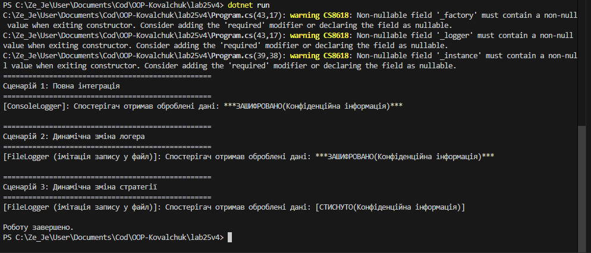

# Лабораторна робота No25
## Тема: Інтеграція патернів (підготовка до екзамену).
## Мета: Розробити систему, що демонструє взаємодію між компонентами, які реалізують патерни Factory Method, Singleton, Strategy та Observer, а також переконатися в коректності їхньої спільної роботи.

## 1. Архітектура та інтеграція системи

У рамках лабораторної роботи було реалізовано комплексну систему, яка об'єднує чотири різні патерни проєктування в єдиний злагоджений механізм. Система складається з трьох логічних блоків:
1. **Блок логування (Singleton + Factory Method):** Централізований менеджер логування, який створює конкретні логери через фабрику.
2. **Блок обробки даних (Strategy):** Механізм динамічної зміни алгоритмів трансформації даних (шифрування або стиснення).
3. **Блок сповіщень (Observer):** Механізм публікації результатів та інформування підписаних компонентів про завершення обробки.

## 2. Реалізація компонентів

### Factory Method та Singleton
Створено ієрархію `LoggerFactory` (`ConsoleLoggerFactory`, `FileLoggerFactory`), що інкапсулює логіку створення об'єктів `ILogger`. Клас `LoggerManager` реалізує патерн Singleton, гарантуючи існування лише одного екземпляра менеджера в системі. Менеджер отримує фабрику та використовує її для створення потрібного логера, що дозволяє змінювати спосіб логування для всієї системи одночасно.

### Strategy
Інтерфейс `IDataProcessorStrategy` визначає контракт для обробки рядків. Створено дві реалізації: `EncryptDataStrategy` та `CompressDataStrategy`. Клас `DataContext` делегує безпосередню обробку обраній стратегії, дозволяючи динамічно перемикати алгоритми під час виконання програми.

### Observer
Клас `DataPublisher` містить подію `DataProcessed`. Об'єкт `ProcessingLoggerObserver` підписується на цю подію. Коли дані оброблені, видавець викликає подію, а спостерігач реагує на неї, звертаючись до глобальної точки доступу `LoggerManager.Instance` для логування результату.

## 3. Опис сценаріїв демонстрації

### Сценарій 1: Повна інтеграція
- `LoggerManager` ініціалізується `ConsoleLoggerFactory`.
- Дані обробляються через `DataContext` за допомогою алгоритму `EncryptDataStrategy`.
- `DataPublisher` сповіщає `ProcessingLoggerObserver`, який успішно фіксує отримані зашифровані дані в консоль за допомогою поточного логера.

### Сценарій 2: Динамічна зміна логера
- Фабрику всередині `LoggerManager` було динамічно замінено на `FileLoggerFactory`.
- Повторна генерація події успішно продемонструвала, що спостерігач автоматично почав використовувати новий спосіб логування (імітація запису у файл) без жодних змін у власному коді.

### Сценарій 3: Динамічна зміна стратегії
- У об'єкті `DataContext` було динамічно замінено алгоритм обробки на `CompressDataStrategy`.
- Наступна ітерація продемонструвала застосування нового алгоритму до даних та їх успішне логування.

## Висновок
- Інтеграція патернів дозволяє створювати гнучкі та слабко зв'язані архітектури.
- Використання Singleton разом із Factory Method дозволило створити універсальну, глобально доступну та конфігуровану систему логування.
- Патерн Observer чудово доповнює Strategy, дозволяючи розділити процес обчислення (трансформації) даних та процес реакції на результат обчислення.
- Модульність рішення гарантує, що зміна алгоритму (Strategy) або способу виведення даних (Factory Method) не вимагає втручання в інші частини коду.
## Приклад запуску
