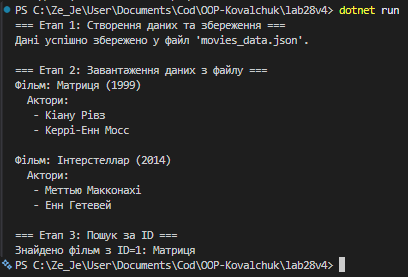

# Лабораторна робота №28
## Тема: Серіалізація об'єктів у JSON
## Мета: Навчитися серіалізувати та десеріалізувати складні об'єкти у форматі JSON, зберігати дані у файли та завантажувати їх за допомогою асинхронних операцій.

## 1. Початкова проблема

В багатьох додатках виникає необхідність зберігати дані, що складаються з об'єктів та їхніх колекцій. Наприклад, інформація про фільми та акторів.

Основна проблема:
- **Як ефективно зберегти складні об'єкти на диску?** Просто написати у текстовий файл неефективно та неправильно.
- **Як завантажити дані назад без втрати структури?** Потрібна стандартизована серіалізація.
- **Як зробити це без блокування основного потоку?** Синхронне читання/запис блокує всю програму.

Наївне рішення: використовувати синхронний запис, але це блокує потік виконання.

## 2. Аналіз проблеми та рішення

Асинхронна JSON-серіалізація розв'язує все це:
- **Асинхронність**: `async/await` операції не блокують потік
- **Стандартний формат**: JSON є універсальним, людиночитаним, легко парсується
- **Структурованість**: `System.Text.Json` автоматично обробляє вкладені об'єкти та колекції
- **Форматування**: JSON зберігається з красивими відступами для читабельності
- **Ефективність**: `FileStream` забезпечує ефективну роботу з файлами

## 3. Реалізовано рішення

### Варіант 4: Фільми (Movie, Actor, MovieRepository)

**Класи предметної області:**
- **Actor** - представляє актора
  - `int Id` - унікальний ідентифікатор
  - `string FullName` - повне ім'я

- **Movie** - представляє фільм
  - `int Id` - унікальний ідентифікатор
  - `string Title` - назва фільму
  - `int Year` - рік випуску
  - `List<Actor> Actors` - колекція акторів у фільмі

**Репозиторій (MovieRepository):**
- `Add(Movie movie)` - додавання фільму до колекції
- `GetAll()` - отримання всіх фільмів
- `GetById(int id)` - пошук фільму за ID
- `SaveToFileAsync(string filename)` - асинхронне збереження у JSON
- `LoadFromFileAsync(string filename)` - асинхронне завантаження з JSON

**Технічні деталі:**
- `System.Text.Json` для серіалізації/десеріалізації
- `FileStream` для ефективної роботи з файлами
- `async/await` для асинхронних операцій
- `WriteIndented: true` для красивого JSON форматування

## 4. Демонстрація роботи

Програма виконує три чітко визначені етапи:

**Етап 1: Створення даних та збереження**
- Створюємо об'єкти фільмів з колекціями акторів
- Асинхронно зберігаємо всю колекцію у файл `movies_data.json`
- Видимо на екрані: "Дані успішно збережено"

**Етап 2: Завантаження даних з файлу**
- Створюємо НОВИЙ репозиторій (пустий!)
- Асинхронно завантажуємо дані з файлу JSON
- Це доказує, що дані були правильно збережені та прочитані назад

**Етап 3: Пошук за ID**
- Демонструємо функцію пошуку конкретного фільму
- Виводимо знайдений фільм та його акторів

### Приклад виходу програми:

## 5. Висновок

- **Асинхронна JSON-серіалізація** дозволяє безпечно зберігати та завантажувати складні об'єкти з вкладеними колекціями
- **Асинхронність** гарантує, що операції з файлами не блокують основний потік, що критично для серверів та UI додатків
- **System.Text.Json** автоматично обробляє вкладені об'єкти та колекції без додаткового коду
- Цей підхід є основою для роботи з БД, REST API, кешуванням та персистентністю даних
- JSON формат дозволяє легко читати та редагувати дані вручну