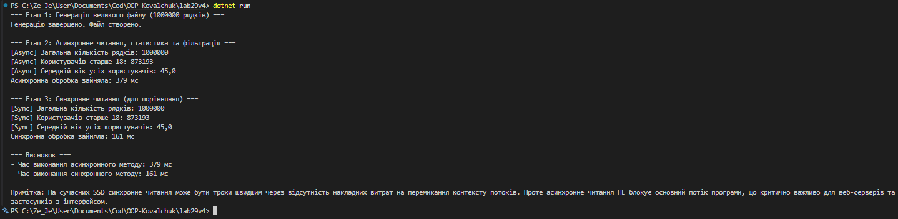

# Лабораторна робота №29
## Тема: Асинхронне читання великих файлів
## Мета: Навчитися ефективно працювати з великими файлами за допомогою асинхронного потокового читання та запису. Порівняти продуктивність синхронного та асинхронного підходів.

## 1. Початкова проблема

При роботі з великими файлами (мільйони рядків) виникає серйозна проблема:
- **Блокування потоку**: синхронне читання (`StreamReader.ReadLine()`) зупиняє виконання програми
- **Неефективність**: основний потік чекає на операції вводу-виводу (I/O)
- **Масштабованість**: неможливо обробляти декілька файлів одночасно
- **Responsiveness**: UI застосунків "зависає" під час обробки великих обсягів даних

Наприклад, читання 1,000,000 рядків синхронно блокує весь додаток.

## 2. Аналіз проблеми та рішення

Асинхронне читання розв'язує ці проблеми:
- **Non-blocking I/O**: операції з файлами не блокують потік
- **효율性**: потік може виконувати інші задачі поки чекає на I/O
- **Масштабованість**: система може обробляти багато файлів одночасно
- **Responsiveness**: UI залишається реактивним
- **Вимірюваність**: можна порівняти продуктивність обох підходів

## 3. Реалізовано рішення

### Варіант 4: Користувачі - Фільтрація за віком > 18

**Компоненти програми:**

1. **GenerateLargeFileAsync()**
   - Генерує CSV з 1,000,000 рядків (Id, Name, Age)
   - Асинхронна генерація (`await writer.WriteLineAsync()`)

2. **ProcessFileAsync()** - АСИНХРОННА версія
   - Читає рядок за рядком (`await reader.ReadLineAsync()`)
   - Агрегує статистику: кількість, статус > 18, середній вік
   - Фільтрує та записує дорослих (`age > 18`)
   - Вимірюється час виконання

3. **ProcessFileSync()** - СИНХРОННА версія (для порівняння)
   - Ідентична логіка, але синхронно
   - Читає `reader.ReadLine()` (блокуючий виклик)
   - Записує `writer.WriteLine()` (блокуючий виклик)

**Статистика, що обраховується:**
- Загальна кількість рядків
- Кількість користувачів старше 18 років
- Середній вік всіх користувачів

## 4. Демонстрація роботи

**Етап 1: Генерація великого файлу**
- Асинхронно створює 1,000,000 рядків

**Етап 2: Асинхронна обробка**
- Асинхронно читає, фільтрує та записує
- Вимірює час

**Етап 3: Синхронна обробка**
- Виконує те саме синхронно
- Вимірює час для порівняння

**Етап 4: Аналіз результатів**
- Показує різницю у часах
- Поясніть переваги асинхронності

### Приклад виходу:

## 5. Висновок

- **Асинхронність** не завжди швидша, але **не блокує потік**
- На SSD синхронне може бути швидше через меншу накладність
- Але для веб-серверів, UI та масштабування асинхронність **критична**
- Можна обробляти декілька файлів одночасно без взаємної блокади
- Це стандарт у сучасних додатках (Node.js, async/await в Python, C# тощо)