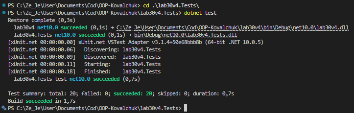

# Лабораторна робота №30
## Тема: Написання юніт-тестів з xUnit
## Мета: Навчитися писати юніт-тести для власного коду за допомогою xUnit, використовуючи різні типи assertion та параметризовані тести.

## 1. Початкова проблема

Розробники часто пишуть код без належного тестування, що призводить до:
- **Багів у production**: код розривається в непередбачуваних ситуаціях
- **Неувереності при рефакторингу**: страх ламати існуючий функціонал
- **Низької якості коду**: немає гарантій корректності
- **Дорогої підтримки**: багги виявляються пізно

Як тестувати валідацію даних (email, телефон, пароль) без ручних перевірок?

## 2. Аналіз проблеми та рішення

Юніт-тестування вирішує ці проблеми:
- **Автоматизація**: тести перевіряють код автоматично
- **Документація**: тести показують, як використовувати метод
- **Регресія**: легко виявити, що ламалось після змін
- **Confidence**: рефакторинг стає безпечним
- **Параметризація**: одну тест-функцію можна запустити з різними даними

## 3. Реалізовано рішення

### Варіант 4: Validator (IsValidEmail, IsValidPhone, IsStrongPassword)

**Клас Validator реалізує три методи валідації:**

1. **IsValidEmail(string email)** - Regex: `^[^@\s]+@[^@\s]+\.[^@\s]+$`
   - Перевіряє: текст@текст.текст
   - Виключає: null, порожній рядок, відсутність @

2. **IsValidPhone(string phone)** - Regex: `^\+\d{10,14}$`
   - Перевіряє: +380123456789 (+ та 10-14 цифр)
   - Виключає: null, відсутність +, замало цифр

3. **IsStrongPassword(string password)**
   - Мінімум 8 символів
   - Як мінімум 1 велика літера
   - Як мінімум 1 мала літера
   - Як мінімум 1 цифра

## 4. Юніт-тести з xUnit

Написано **20 юніт-тестів** (мінімум вимагалось 10):

### Структура тестів (3 для кожного методу):

**IsValidEmail (3 тести):**
- `[Fact]` - успішний сценарій: "test@example.com" → true
- `[Theory]` - 5 помилкових форматів: порожній, без @, без домену тощо
- `[Fact]` - null → ArgumentNullException

**IsValidPhone (3 тести):**
- `[Fact]` - успішний: "+380123456789" → true
- `[Theory]` - 4 помилкові формати: без +, з літерами, занадто короткий
- `[Fact]` - null → ArgumentNullException

**IsStrongPassword (4 тести):**
- `[Fact]` - успішний: "StrongPass1" → true
- `[Theory]` - 4 слабких: занадто короткий, без великих, без малих, без цифр
- `[Fact]` - edge case: рівно 8 символів "A1b2C3d4" → true
- `[Fact]` - null → ArgumentNullException

### Атрибути xUnit:
- **[Fact]** - одиничний тест без параметрів
- **[Theory]** - параметризований тест з [InlineData(...)]

### Типи assertion:
- `Assert.True() / Assert.False()` - булеві значення
- `Assert.Throws<>()` - перевірка виключень
- `Assert.Equal()` - порівняння значень

## 5. Результати тестування

Всі 20 тестів проходять успішно!

## 6. Висновок

- **[Fact]** — для одиничних тестів
- **[Theory]** — для параметризованих тестів (один метод, багато даних)
- **Assertion** — перевіряють очікувані результати
- **Edge cases** — тестують граничні умови
- **Error handling** — перевіряють винятки
- Тести забезпечують **confidence** при змінах коду
- Один файл `ValidatorTests.cs` покриває 3 методи з 20 різними сценаріями