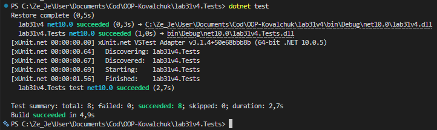

# Лабораторна робота №31
## Тема: Тестування з Moq (мокінг залежностей)
## Мета: Навчитися створювати mock-об'єкти за допомогою Moq для тестування класів з залежностями, використовувати Setup та Verify.

## 1. Початкова проблема (з порушеннями DIP)

При тестуванні класів з залежностями виникає серйозна проблема:
- **Жорсткі залежності**: клас містить `new ProductRepository()` всередині
- **Неможливість мокування**: неможливо замінити залежність на тестовий double
- **Інтеграційні тести**: тести залежать від реальних об'єктів БД, мережі тощо
- **Складність тестування**: кожен тест повинен налаштовувати реальне оточення
- **Не можна тестувати логіку ізольовано**: логіка неправильно змішана з інфраструктурою

### Приклад "поганого" коду:
```csharp
public class ProductService
{
    private readonly ProductRepository _repo = new ProductRepository(); //  Hard-coded!
    private readonly StockService _stock = new StockService(); //  Hard-coded!
}
```

## 2. Аналіз проблеми та рішення

Principle of Dependency Inversion (DIP) та Moq-тестування розв'язують це:
- **Абстракції замість конкретики**: передавати інтерфейси, не класи
- **Dependency Injection**: залежності передаються в конструктор
- **Moq (mocking)**: замінювати реальні об'єкти на підроблені для тестів
- **Ізоляція**: тестувати логіку окремо від інфраструктури
- **Setup & Verify**: налаштовувати поведінку та перевіряти викики

### Правильний код:
```csharp
public class ProductService
{
    private readonly IProductRepository _repo;
    private readonly IStockService _stock;
    
    public ProductService(IProductRepository repo, IStockService stock)
    {
        _repo = repo ?? throw new ArgumentNullException(nameof(repo));
        _stock = stock ?? throw new ArgumentNullException(nameof(stock));
    }
}
```

## 3. Реалізовано рішення

### Варіант 4: ProductService (IProductRepository, IStockService)

**Модель даних:**
- **Product** - Id, Name, Price

**Залежності (інтерфейси):**
- **IProductRepository** - GetById(), Add(), Update()
- **IStockService** - HasEnoughStock(), DeductStock()

**Основний сервіс:**
- **ProductService** - залежності через конструктор (DI)
  - GetProduct(id)
  - CreateProduct(product)
  - UpdatePrice(id, newPrice)
  - OrderProduct(id, quantity)

## 4. Юніт-тести з Moq

Написано **8 юніт-тестів** з використанням Setup та Verify:

### Конструкція тестів:

**Setup** - налаштовуємо поведінку mock:
```csharp
_mockRepo.Setup(r => r.GetById(1)).Returns(expectedProduct);
_mockStock.Setup(s => s.HasEnoughStock(It.IsAny<int>(), 5)).Returns(true);
```

**Act** - викликаємо метод:
```csharp
var result = _service.GetProduct(1);
```

**Verify** - перевіряємо, що залежності були викликані правильно:
```csharp
_mockRepo.Verify(r => r.GetById(1), Times.Once);
_mockStock.Verify(s => s.DeductStock(1, 5), Times.Once);
```

### Тести:
1. **GetProduct** - повертає продукт з репозиторію
2. **GetProduct_NotFound** - повертає null
3. **CreateProduct** - додає продукт у репозиторій
4. **CreateProduct_Null** - викидає ArgumentNullException
5. **UpdatePrice** - оновлює ціну й викликає Update
6. **UpdatePrice_NotFound** - викидає InvalidOperationException
7. **OrderProduct_WithStock** - списує товар зі складу
8. **OrderProduct_NoStock** - повертає false, не списує

### Оператори часто:
- **Times.Once** - метод викликаний рівно 1 раз
- **Times.Never** - метод НЕ був викликаний
- **It.IsAny<>()** - будь-яке значення параметра

## 5. Результати тестування



 Всі 8 тестів проходять успішно!

## 6. Висновок

- **Dependency Injection** — залежності передаються в конструктор, не створюються всередину
- **Moq** — замінює реальні об'єкти на підроблені для тестів
- **Setup** — налаштовує поведінку mock-об'єктів
- **Verify** — перевіряє, що методи були викликані правильно
- **Ізоляція** — тестуємо логіку сервісу без БД, мережі, файлів тощо
- **Гнучкість** — легко заміняти реалізації без змін тестів
- Це стандартний підхід у професійній розробці
