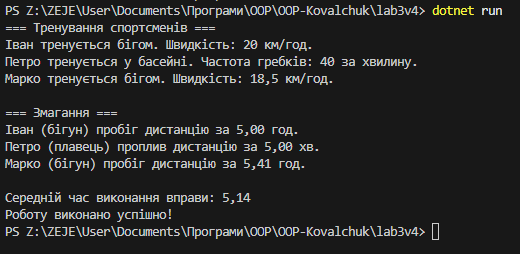

Лабораторна робота №3
Тема: Наслідування: основи

Мета роботи
Закріпити знання про базові класи, похідні класи, модифікатори доступу, використання base, поліморфізм у простій формі.

Опис реалізації
Створено базовий клас Athlete з методами Train(), Compete() та GetRating().  
Створено похідні класи Runner та Swimmer, які перевизначають методи базового класу (override).  
Використано конструктори з параметрами та виклик базового конструктора через base(...).  
Демонстровано поліморфізм часу виконання: список List Athlete містить різні об’єкти, але виклик методів відбувається відповідно до реального типу об’єкта.  
Розрахунок рейтингу спортсмена проводиться як 1000 / AverageTime.  
Код містить коментарі до ключових частин.

Контрольні запитання
1. Що таке наслідування та для чого воно використовується?
Наслідування — це механізм ООП, який дозволяє створювати нові класи (похідні) на основі вже існуючих (базових)

2. Чим відрізняється virtual від abstract методу?
virtual – метод базового класу, який можна перевизначити в похідному класі, але це не обов’язково. Має реалізацію у базовому класі.
abstract – метод без реалізації у базовому класі, його обов’язково треба реалізувати у похідному класі. Може бути тільки у абстрактному класі.

3. Як працює ключове слово base?
base використовується для звернення до членів базового класу з похідного

4. Що таке поліморфізм часу виконання?
Це можливість викликати методи похідного класу через посилання на базовий клас.

5. У чому різниця між композицією та наслідуванням?
Наслідування: "є вид/є тип", похідний клас розширює базовий.
Композиція: "має об’єкт", клас використовує інший клас як частину.

