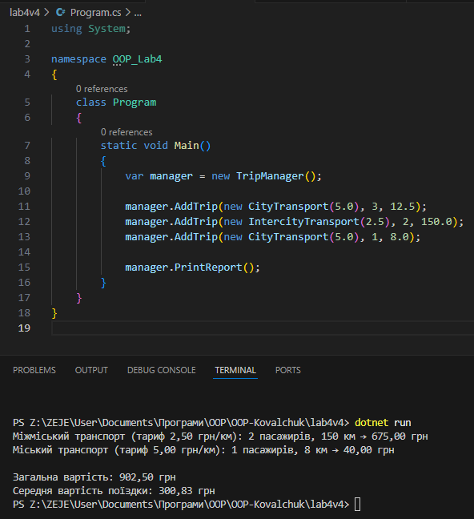

# Лабораторна робота №4
**Тема: Абстракції та інтерфейси. Композиція та агрегація.**

## Мета роботи
Навчитись створювати абстрактні класи та інтерфейси, будувати ієрархію класів із використанням композиції та агрегації,  реалізовувати прості обчислення, демонструвати гнучкість і повторне використання коду.

## Опис реалізації
1. Створено **інтерфейс `IFareCalculator`** з методом csharp double CalculateFare(int passengers, double distance);
2. Створено **абстрактний клас `Transport`** який реалізує цей інтерфейс і містить спільні поля: `Name` — назва транспорту `BaseRate` — базовий тариф за 1 км
3. Створено **два похідні класи**: `CityTransport` — для розрахунку міських поїздок `IntercityTransport` — для міжміських поїздок із 10% знижкою після 100 км
4. Використано **композицію через клас `TripManager`** який зберігає колекцію поїздок і виконує: обчислення сумарної вартості обчислення середньої ціни
5. Програма виводить докладний звіт по поїздках у консоль.

## Контрольні запитання
1. **У чому різниця між абстрактним класом і інтерфейсом?**
Інтерфейс задає лише контракт (методи без реалізації), а абстрактний клас може містити як абстрактні, так і реалізовані члени.

2. **Коли краще використовувати композицію, а коли наслідування?**
Наслідування — коли один клас є різновидом іншого (“є типом”),
композиція — коли один клас містить інший (“має”).

3. **Як працює агрегація і чим вона відрізняється від композиції?**
В агрегації об’єкт може існувати незалежно (слабкий зв’язок),
у композиції — частини не можуть існувати без цілого.

4. **Чи може клас реалізовувати кілька інтерфейсів одночасно?**
Так, у C# клас може реалізовувати кілька інтерфейсів, розділяючи їх комами.

5. **Для чого в ООП використовують інтерфейси як контракти?**
Щоб визначити набір методів, який клас зобов’язаний реалізувати, незалежно від його ієрархії.

## Приклад запуску

## Висновок
В ході лабораторної роботи було закріплено знання про абстрактні класи та інтерфейси,
навчились створювати ієрархії класів із використанням композиції,
реалізовувати обчислення вартості поїздок,
а також формувати структуровані звіти у консоль.
Робота демонструє гнучкість і повторне використання коду.
У роботі використано **композицію** (TripManager керує поїздками, які не існують без нього) та **агрегацію**(Transport існує незалежно і передається в TripManager).