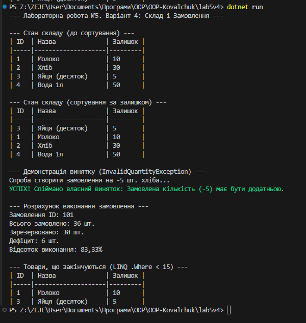

# Лабораторна робота №5: Generics, Колекції, LINQ, Винятки

**Варіант 4: Склад і замовлення (Stock/Order)**

Програма моделює базову логіку складу та обробки замовлень.

## Можливості

* **Generics:** Використано узагальнений `Repository<T>` для зберігання `StockItem`.
* **Композиція:** `Order` містить список `OrderLine` (позицій замовлення).
* **LINQ:** Використовується для фільтрації (`Where`) та розрахунків (`Sum`).
* **IComparer:** `StockItemByQuantityComparer` сортує товари за залишком на складі.
* **Винятки:** `InvalidQuantityException` генерується при спробі замовити від'ємну або нульову кількість товару.

## Приклад запуску (скриншот виводу)

Ось приклад роботи програми, що демонструє сортування, обробку винятку та фінальні розрахунки.

---

##  Контрольні запитання

### 1. Що таке generics? Які їхні переваги?

**Узагальнення (Generics)** — це механізм у C#, що дозволяє створювати класи, інтерфейси та методи, які можуть працювати з *будь-яким* типом даних, не втрачаючи при цьому **безпеки типів** (type safety).

**Переваги:**
* **Безпека типів:** Компілятор перевіряє типи під час компіляції (ви не можете додати `int` до `List<string>`).
* **Повторне використання коду:** Один раз пишете `List<T>` і використовуєте його для всіх типів.
* **Продуктивність:** Уникає "упаковки" та "розпаковки" (boxing/unboxing) для типів-значень.

### 2. Які основні відмінності між ArrayList і List<T>?

| Характеристика | `ArrayList` (застарілий) | `List<T>` (сучасний) |
| :--- | :--- | :--- |
| **Типізація** | Неузагальнений (non-generic). | Узагальнений (generic). |
| **Зберігання** | Зберігає елементи як `object`. | Зберігає елементи конкретного типу `T`. |
| **Безпека типів** | Відсутня. Потребує ручного приведення типів. | Гарантована компілятором. |
| **Продуктивність** | Низька для типів-значень (boxing). | Висока, boxing відсутній. |
| **Рекомендація** | Не рекомендується. | **Рекомендований** вибір. |

### 3. Чим відрізняється Dictionary<TKey,TValue> від List<T>?

* **`List<T>` (Список):** Зберігає впорядковану колекцію. Доступ здійснюється за **числовим індексом** (позицією). Пошук елемента за значенням — повільний (`O(n)`).
* **`Dictionary<TKey,TValue>` (Словник):** Зберігає пари **"ключ-значення"**. Доступ здійснюється за унікальним **ключем**. Пошук за ключем — дуже швидкий (в середньому `O(1)`).

### 4. У чому перевага LINQ над класичними циклами?

LINQ — це **декларативний** підхід, що описує *що* ви хочете отримати, а не *як* це зробити (на відміну від **імперативних** циклів).

* **Читабельність:** LINQ-вирази (`.Where(...)`) часто коротші та краще виражають намір.
* **Універсальність:** Однаковий синтаксис для роботи з об'єктами, базами даних, XML.
* **Композиція:** Запити легко комбінувати, не змінюючи початковий код.

### 5. Як працює ключове слово finally?

Блок `finally` у конструкції `try-catch-finally` виконується **завжди**, незалежно від того, що сталося в блоці `try`:
1.  Якщо `try` виконавcя успішно.
2.  Якщо в `try` стався виняток, і його було оброблено в `catch`.
3.  Якщо в `try` стався виняток, але не було відповідного `catch`.

**Призначення:** Гарантоване звільнення ресурсів (закриття файлів, з'єднань з БД).

### 6. Коли доцільно створювати власні класи винятків?

Коли стандартні винятки .NET (як-от `ArgumentException`) **недостатньо точно описують** специфічну помилкову ситуацію у вашій бізнес-логіці.

**Переваги:**
* **Точність:** Ви чітко сигналізуєте, *що саме* пішло не так (`InvalidQuantityException` інформативніше, ніж `Exception`).
* **Вибіркова обробка:** Дозволяє створювати окремі блоки `catch` для обробки *конкретних* помилок вашої системи.