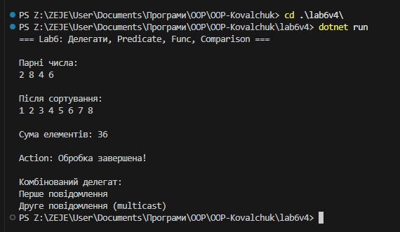

# Лабораторна робота №6
**Тема: Лямбда-вирази, анонімні функції та делегати у C#**

## Мета роботи
Закріпити знання про делегати та події, навчитися використовувати анонімні методи, лямбда-вирази та вбудовані делегати (**Func<>, Action<>, Predicate<>**), отримати практичний досвід обробки колекцій за допомогою LINQ.

## Опис реалізації
Створено колекцію List<int> із числами 5, 2, 8, 1, 7, 4, 3, 6. Для фільтрації парних чисел використано Predicate<int> isEven, який передається в метод FindAll(). Для сортування колекції застосовано Comparison<int> через анонімний метод delegate (int a, int b) { return a.CompareTo(b); }. Підрахунок суми елементів здійснено через Func<int,int,int> add у поєднанні з LINQ-методом Aggregate. Для виводу результатів використано Action<string> print, а також продемонстровано комбінований делегат (multicast Action), який виконує кілька методів одночасно. Всі операції виконуються в консолі, демонструючи практичне застосування делегатів, лямбда-виразів і анонімних методів у C#.

## Приклад запуску

## Висновок
В ході лабораторної роботи було закріплено знання про делегати, анонімні методи та лямбда-вирази.
Навчились використовувати стандартні делегати (Func, Action, Predicate) для обробки колекцій та обчислень.
Демонструвалася робота з LINQ-операціями (Where, Select, OrderBy, Aggregate) для фільтрації, сортування та підрахунку сум.
Робота показала ефективність делегатів для компактного та гнучкого коду.
Було продемонстровано комбінований делегат, який виконує кілька методів одночасно, що є бонусним прикладом.