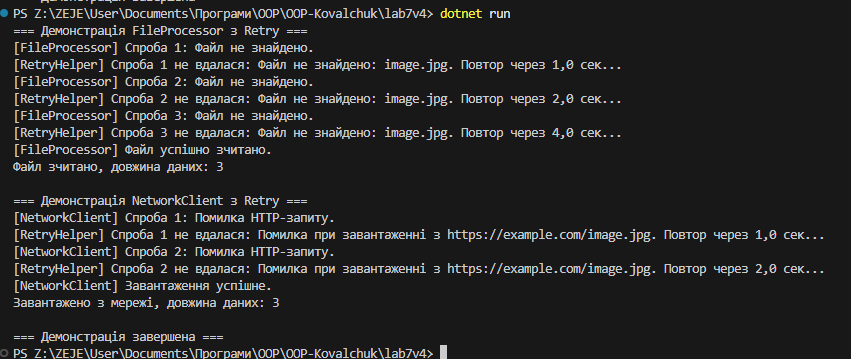

# Лабораторна робота №7
**Тема: Обробка IO/мережевих помилок та патерн Retry**

## Мета роботи
Навчитись обробляти типові помилки вводу/виводу та мережеві помилки за допомогою блоків `try-catch-finally`, а також реалізувати патерн **Retry** для підвищення відмовостійкості застосунків.

## Опис реалізації
1. Створено клас **`FileProcessor`** з методом `ReadImage(string path)`, який імітує зчитування файлу.  
   - Перші 3 спроби викидає `FileNotFoundException`, потім повертає масив байтів.  

2. Створено клас **`NetworkClient`** з методом `DownloadImage(string url)`, який імітує завантаження з мережі.  
   - Перші 2 спроби викидає `HttpRequestException`, потім повертає масив байтів.  

3. Реалізовано узагальнений статичний клас **`RetryHelper`** з методом `ExecuteWithRetry<T>`:  
   - Параметри: операція (`Func<T>`), кількість повторів, початкова затримка (`TimeSpan`), делегат `shouldRetry` для вибіркової обробки винятків.  
   - Підтримка **експоненційної затримки** між спробами: `initialDelay * 2^(attempt-1)`.  
   - Логування кожної спроби та причини невдачі у консоль.  

4. В методі `Main` продемонстровано:  
   - Використання `RetryHelper` для `FileProcessor` та `NetworkClient`.  
   - Сценарії тимчасових помилок, що потім успішно завершуються.  
   - Використання `shouldRetry` для вибіркової обробки винятків `FileNotFoundException` та `HttpRequestException`.  

## Контрольні запитання
1. **Які типи винятків найчастіше виникають при роботі з файлами та мережею?**  
   - Файли: `FileNotFoundException`, `DirectoryNotFoundException`, `IOException`.  
   - Мережа: `HttpRequestException`, `SocketException`.  

2. **Поясніть принцип роботи патерну Retry. Коли його доцільно використовувати?**  
   - Retry повторює операцію, яка тимчасово може завершитися невдачею, до досягнення успіху або максимуму спроб.  
   - Використовується для обробки тимчасових помилок, наприклад мережевих або IO-запитів.  

3. **Як реалізувати експоненційну затримку між повторними спробами?**  
   - Збільшувати час очікування після кожної невдалої спроби: `delay = initialDelay * 2^(attempt-1)`.  

4. **Для чого потрібен делегат `shouldRetry` у `RetryHelper`?**  
   - Щоб вибірково визначати, для яких типів винятків слід повторювати операцію, а для яких – ні.  

## Приклад запуску

## Висновок
В ході лабораторної роботи було закріплено навички:  
- обробки **IO- та мережевих винятків** за допомогою `try-catch-finally`;  
- реалізації **патерну Retry** з експоненційною затримкою;  
- логування та вибіркової обробки помилок через делегат `shouldRetry`.  